# UML — ABIS-UPC | Microservicio Biométrico Python (abis-biometric)
## v2 — Digital Persona + MediaPipe Liveness + OCR pipeline
## Pega el bloque mermaid en: https://mermaid.live  o  https://www.mermaidchart.com
##
## ══════════════════════════════════════════════════════════════════
## PARA EL EQUIPO — RESPONSABLE: Ing. Daniel Turizo
## RAMA: feature/biometric
## ══════════════════════════════════════════════════════════════════
##
##  app/
##  ├── main.py                      ← solo inicializa FastAPI y registra routers
##  ├── core/
##  │   └── config.py                ← variables de entorno Python
##  ├── routers/
##  │   ├── ocr_router.py            ← POST /ocr/scan, POST /ocr/live-frame
##  │   ├── scanner_router.py        ← POST /scanner/read (YHD-9300 si disponible)
##  │   ├── fingerprint_router.py    ← POST /fingerprint/enroll, /verify, /status
##  │   └── face_router.py           ← POST /face/capture, GET /face/status
##  ├── services/
##  │   ├── document_classifier.py   ← PASO 1 OCR: clasifica tipo por visión
##  │   ├── roi_extractor.py         ← PASO 2 OCR: mapas de coordenadas por tipo
##  │   ├── ocr_engine.py            ← PASO 3 OCR: preprocesamiento + Tesseract
##  │   ├── document_parser.py       ← PASO 4 OCR: extrae campos del texto
##  │   ├── scanner_service.py       ← YHD-9300: PDF417/QR (si disponible)
##  │   ├── fingerprint_service.py   ← Digital Persona: USB HID, SDK dpfj
##  │   └── face_service.py          ← MediaPipe: liveness + captura de rostro
##  └── schemas/
##      ├── ocr_schema.py            ← Pydantic OCR/scanner
##      ├── fingerprint_schema.py    ← Pydantic huella
##      └── face_schema.py           ← Pydantic captura facial
##
## ══════════════════════════════════════════════════════════════════
## DECISIONES DE DISEÑO — NO CAMBIAR SIN CONSENSO
## ══════════════════════════════════════════════════════════════════
##
## [P1] HARDWARE DE HUELLA — Digital Persona (USB HID):
##      Reemplaza AS608 (UART). Ventajas: plug and play, sin circuito adaptador.
##      SDK: dpfj (DigitalPersona Fingerprint SDK) o libfprint (Linux).
##      Template: ISO/IEC 19794-2, mayor tamaño que AS608.
##      El template NUNCA se almacena en Python — se retorna a Java.
##      Java lo cifra con AES-256 antes de guardar en Oracle.
##
## [P2] HARDWARE ESCÁNER 2D — YHD-9300 (estado: probable, no confirmado):
##      Si disponible: canal principal PDF417/QR para pre-registro (~99% eficacia).
##      Si no disponible: OCR+OpenCV como único canal de datos del documento.
##      El servicio verifica si el escáner está conectado antes de intentar leer.
##      Retorna OcrResponse con fuente="pdf417" o fuente="qr".
##
## [P3] CAPTURA FACIAL — MediaPipe + OpenCV:
##      Flujo: video en vivo → detección de rostro → cálculo EAR → 3 parpadeos →
##      captura del frame → guarda como JPEG local → retorna ruta.
##      EAR (Eye Aspect Ratio): proporción alto/ancho del ojo usando landmarks.
##      EAR < 0.25 = ojo cerrado. Secuencia de apertura-cierre = parpadeo.
##      Solo para pre-registro (guardar foto). NO para identificación.
##      La cámara también muestra bounding box de guía para el documento (P4).
##
## [P4] OCR PIPELINE — 4 pasos secuenciales:
##      1. DocumentClassifier: clasifica tipo visualmente (SIN Tesseract)
##      2. RoiExtractor: coordenadas (x,y,w,h) por tipo y campo
##      3. OcrEngine: preprocesa ROI recortada + Tesseract psm específico
##      4. DocumentParser: extrae campos, corrige errores OCR
##      Tesseract sobre ROI recortada = ~70% vs imagen completa = ~20%.
##
## [P5] RESPUESTA UNIFICADA — OcrResponse:
##      OCR y escáner retornan OcrResponse con campo fuente.
##      Java no distingue el origen — solo consume el DTO.
##
## [P6] CÓDIGO LIMPIO:
##      SRP: un archivo = una responsabilidad.
##      Sin hardcode: todo en core/config.py.
##      Funciones máximo 20 líneas.
##      Tests: tests/ con un archivo por servicio.

```mermaid
classDiagram
  direction TB

  %% ╔══════════════════════════════════════════════════════════╗
  %% ║  PUNTO DE ENTRADA — app/main.py                          ║
  %% ╚══════════════════════════════════════════════════════════╝

  class FastAPIApp {
    <<Singleton — main.py>>
    %% Puerto 8000. Solo acepta conexiones desde Java :7000
    -title : str
    -version : str
    -allowed_origins : list
    +startup() None
    -registrar_routers() None
    -configurar_cors() None
  }

  class AppConfig {
    <<Singleton — core/config.py>>
    %% Sin SENSOR_PORT ni SENSOR_BAUD: Digital Persona es USB HID (no serial)
    -TESSERACT_CMD : str$
    -SCANNER_PORT : str$
    -SCANNER_BAUD : int$
    -FOTO_STORAGE_PATH : str$
    -MIN_OCR_CHARS : int$
    -EAR_THRESHOLD : float$
    -PARPADEOS_REQUERIDOS : int$
    +get_tesseract_cmd() str$
    +get_scanner_port() str$
    +get_foto_storage_path() str$
    +get_ear_threshold() float$
    -validar_entorno() None$
  }

  %% ╔══════════════════════════════════════════════════════════╗
  %% ║  ROUTERS — app/routers/                                  ║
  %% ╚══════════════════════════════════════════════════════════╝

  class OcrRouter {
    <<Router — routers/ocr_router.py>>
    %% GET  /health
    %% POST /ocr/scan       → cámara + Tesseract pipeline 4 pasos
    %% POST /ocr/live-frame → frame de video → bounding box guía
    +health() dict
    +ocr_scan(file : UploadFile) OcrResponse
    +live_frame(file : UploadFile) BoundingBoxResponse
    -_validar_archivo(file : UploadFile) None
  }

  class ScannerRouter {
    <<Router — routers/scanner_router.py>>
    %% POST /scanner/read   → YHD-9300 si disponible
    %% GET  /scanner/status → verifica conexión del escáner
    +scanner_read() OcrResponse
    +scanner_status() dict
  }

  class FingerprintRouter {
    <<Router — routers/fingerprint_router.py>>
    %% POST /fingerprint/enroll → Digital Persona: captura y retorna template
    %% POST /fingerprint/verify → compara muestra vs template recibido
    %% GET  /fingerprint/status → Digital Persona conectado y operativo
    +fingerprint_enroll(request : FingerprintEnrollRequest) FingerprintEnrollResponse
    +fingerprint_verify(request : FingerprintVerifyRequest) FingerprintMatchResponse
    +fingerprint_status() dict
  }

  class FaceRouter {
    <<Router — routers/face_router.py>>
    %% POST /face/capture → activa cámara, espera 3 parpadeos, guarda foto
    %% GET  /face/status  → cámara conectada y MediaPipe disponible
    +face_capture() FaceCaptureResponse
    +face_status() dict
  }

  %% ╔══════════════════════════════════════════════════════════╗
  %% ║  SERVICIOS OCR — Pipeline 4 pasos [P4]                   ║
  %% ╚══════════════════════════════════════════════════════════╝

  class DocumentClassifier {
    <<Service — services/document_classifier.py>>
    %% PASO 1: clasifica tipo de documento visualmente con OpenCV
    %% SIN Tesseract. Análisis geométrico + colores dominantes.
    %% También detecta orientación H/V para bounding box.
    -COLORES_CC_AMARILLA : dict$
    -ASPECT_RATIO_HORIZONTAL : float$
    +clasificar(img_bgr : ndarray) str
    +detectar_orientacion(img_bgr : ndarray) str
    +calcular_bounding_box(img_bgr : ndarray, orientacion : str) dict
    -analizar_colores_dominantes(img_bgr : ndarray) str
    -analizar_proporcion(img_bgr : ndarray) str
    -detectar_zona_mrz(img_bgr : ndarray) bool
  }

  class RoiExtractor {
    <<Service — services/roi_extractor.py>>
    %% PASO 2: carga mapa de coordenadas ROI para el tipo detectado
    %% Coordenadas distintas por tipo (CC_ANTIGUA, CC_DIGITAL, TI, CARNET_UPC)
    -MAPA_ROI_CC_ANTIGUA : dict$
    -MAPA_ROI_CC_DIGITAL : dict$
    -MAPA_ROI_TI : dict$
    -MAPA_ROI_CARNET_UPC : dict$
    +extraer_rois(img_bgr : ndarray, tipo_doc : str) dict
    +recortar_region(img_bgr : ndarray, roi : dict) ndarray
    -cargar_mapa(tipo_doc : str) dict$
    -validar_coordenadas(roi : dict, img_shape : tuple) bool
  }

  class OcrEngine {
    <<Service — services/ocr_engine.py>>
    %% PASO 3: preprocesa ROI recortada + ejecuta Tesseract
    %% PSM específico por campo: número→psm7, nombres→psm6
    %% Genera variantes (otsu, adaptive, clahe) y elige la mejor
    -OCR_CONFIG_NUMERO : str$
    -OCR_CONFIG_NOMBRE : str$
    -OCR_CONFIG_BLOQUE : str$
    +ejecutar_ocr_campo(roi : ndarray, tipo_campo : str) str
    +preprocesar(roi : ndarray) list
    -otsu(gray : ndarray) ndarray
    -adaptive_threshold(gray : ndarray) ndarray
    -clahe_otsu(gray : ndarray) ndarray
    -elegir_mejor_resultado(variantes : list) str
  }

  class DocumentParser {
    <<Service — services/document_parser.py>>
    %% PASO 4: extrae y limpia campos del texto crudo de Tesseract
    %% Corrige: O→0, l→1, S→5, B→8 (solo en números)
    +parsear(textos_por_campo : dict, tipo_doc : str) OcrResponse
    +extraer_numero_id(texto : str, tipo_doc : str) str
    +extraer_nombre(texto : str, tipo_doc : str) dict
    +extraer_fecha_nacimiento(texto : str) str
    +extraer_sexo(texto : str) str
    -limpiar_numero(raw : str) str
    -corregir_confusiones_ocr(texto : str) str
    -calcular_confianza(campos : dict) int
  }

  %% ╔══════════════════════════════════════════════════════════╗
  %% ║  SERVICIO ESCÁNER 2D — YHD-9300 [P2]                    ║
  %% ╚══════════════════════════════════════════════════════════╝

  class ScannerService {
    <<Service — services/scanner_service.py>>
    %% YHD-9300 en modo RS232 virtual sobre USB
    %% Disponibilidad condicional: verifica conexión antes de leer
    %% Parsea trama PDF417: campos separados por "|"
    -puerto : str
    -baud_rate : int
    -timeout_seg : float
    -conexion : Serial
    +leer_documento() OcrResponse
    +verificar_conexion() bool
    -conectar() None
    -desconectar() None
    -leer_trama_serial() str
    -parsear_pdf417_cedula(trama : str) OcrResponse
    -parsear_qr_cc_digital(trama : str) OcrResponse
    -detectar_tipo_trama(trama : str) str
  }

  %% ╔══════════════════════════════════════════════════════════╗
  %% ║  SERVICIO HUELLA — Digital Persona [P1]                  ║
  %% ╚══════════════════════════════════════════════════════════╝

  class FingerprintService {
    <<Service — services/fingerprint_service.py>>
    %% Digital Persona: USB HID, SDK dpfj [P1]
    %% Sin UART, sin puerto serial, sin circuito adaptador
    %% Template ISO/IEC 19794-2 — más grande que AS608
    %% El template NUNCA se almacena aquí — se retorna a Java
    -dp_reader : DPFJReader
    +enrolar_huella(id_votante : int) FingerprintEnrollResponse
    +verificar_huella(request : FingerprintVerifyRequest) FingerprintMatchResponse
    +obtener_estado() dict
    -inicializar_sdk() None
    -capturar_imagen() bytes
    -extraer_template(imagen : bytes) bytes
    -comparar_templates(t1 : bytes, t2 : bytes) int
  }

  %% ╔══════════════════════════════════════════════════════════╗
  %% ║  SERVICIO FACIAL — MediaPipe Liveness [P3]               ║
  %% ╚══════════════════════════════════════════════════════════╝

  class FaceService {
    <<Service — services/face_service.py>>
    %% MediaPipe FaceMesh: 468 landmarks faciales a ~30fps en CPU
    %% EAR = (|p2-p6| + |p3-p5|) / (2 * |p1-p4|) para cada ojo
    %% EAR < EAR_THRESHOLD → ojo cerrado → cuenta parpadeo
    %% Tras PARPADEOS_REQUERIDOS → captura frame → guarda JPEG → retorna ruta
    -mp_face_mesh : FaceMesh
    -cap : VideoCapture
    -ear_threshold : float
    -parpadeos_requeridos : int
    -foto_storage_path : str
    +capturar_con_liveness(id_votante : int) FaceCaptureResponse
    +verificar_camara() bool
    -calcular_ear(landmarks : list, indices_ojo : list) float
    -detectar_parpadeo(ear : float, estado_anterior : bool) tuple
    -guardar_foto(frame : ndarray, identificacion : str) str
    -generar_frame_respuesta(frame : ndarray, parpadeos : int) dict
  }

  %% ╔══════════════════════════════════════════════════════════╗
  %% ║  SCHEMAS PYDANTIC — app/schemas/                         ║
  %% ╚══════════════════════════════════════════════════════════╝

  class OcrResponse {
    <<Schema — schemas/ocr_schema.py>>
    %% fuente: "tesseract" | "pdf417" | "qr" [P5]
    +tipo_doc : str
    +label_tipo : str
    +nombres : str
    +apellidos : str
    +nombre_completo : str
    +numero_id : str
    +fecha_nacimiento : str
    +sexo : str
    +fuente : str
    +confianza : int
    +nota : str
  }

  class BoundingBoxResponse {
    <<Schema — schemas/ocr_schema.py>>
    %% Para dibujar el recuadro guía en el frontend en tiempo real
    +orientacion : str
    +x : int
    +y : int
    +w : int
    +h : int
    +confianza_deteccion : int
  }

  class FingerprintEnrollRequest {
    <<Schema — schemas/fingerprint_schema.py>>
    +id_votante : int
  }

  class FingerprintEnrollResponse {
    <<Schema — schemas/fingerprint_schema.py>>
    %% template_raw: bytes del template ISO/IEC 19794-2
    %% Java recibe esto y lo cifra con AES-256 antes de Oracle
    +id_votante : int
    +template_raw : bytes
    +calidad : int
    +mensaje : str
    +exitoso : bool
  }

  class FingerprintVerifyRequest {
    <<Schema — schemas/fingerprint_schema.py>>
    %% Java envía el template cifrado; Python lo descifra antes de comparar
    +id_votante : int
    +template_cifrado : bytes
  }

  class FingerprintMatchResponse {
    <<Schema — schemas/fingerprint_schema.py>>
    %% score ≥ 60 = coincidencia aceptable
    +matched : bool
    +score : int
    +id_votante : int
    +mensaje : str
    +fuente : str
  }

  class FaceCaptureResponse {
    <<Schema — schemas/face_schema.py>>
    %% Resultado de la captura facial con liveness detection [P3]
    %% foto_url: ruta relativa del archivo JPEG guardado en el servidor
    %% Java lee esta ruta y la guarda en VOTANTES.FOTO_URL
    +exitoso : bool
    +foto_url : str
    +parpadeos_detectados : int
    +confianza_liveness : int
    +mensaje : str
  }

  %% ══════════════════════════════════════════════════════════
  %% RELACIONES
  %% ══════════════════════════════════════════════════════════

  FastAPIApp *-- OcrRouter : registra >
  FastAPIApp *-- ScannerRouter : registra >
  FastAPIApp *-- FingerprintRouter : registra >
  FastAPIApp *-- FaceRouter : registra >
  FastAPIApp *-- AppConfig : carga al inicio >

  OcrRouter o-- DocumentClassifier : usa >
  OcrRouter o-- RoiExtractor : usa >
  OcrRouter o-- OcrEngine : usa >
  OcrRouter o-- DocumentParser : usa >
  ScannerRouter o-- ScannerService : usa >
  FingerprintRouter o-- FingerprintService : usa >
  FaceRouter o-- FaceService : usa >

  DocumentClassifier ..> BoundingBoxResponse : produce >
  RoiExtractor ..> DocumentClassifier : recibe tipo de >
  OcrEngine ..> RoiExtractor : recibe ROIs de >
  DocumentParser ..> OcrEngine : recibe texto de >
  DocumentParser ..> OcrResponse : produce fuente=tesseract >
  ScannerService ..> OcrResponse : produce fuente=pdf417|qr >
  FingerprintService ..> FingerprintEnrollResponse : produce >
  FingerprintService ..> FingerprintMatchResponse : produce >
  FaceService ..> FaceCaptureResponse : produce >
  OcrRouter ..> OcrResponse : retorna >
  OcrRouter ..> BoundingBoxResponse : retorna >
  ScannerRouter ..> OcrResponse : retorna >
  FingerprintRouter ..> FingerprintEnrollResponse : retorna >
  FingerprintRouter ..> FingerprintMatchResponse : retorna >
  FaceRouter ..> FaceCaptureResponse : retorna >
  ScannerService ..> AppConfig : lee puerto de >
  OcrEngine ..> AppConfig : lee tesseract_cmd de >
  FaceService ..> AppConfig : lee ear_threshold y parpadeos de >
```

