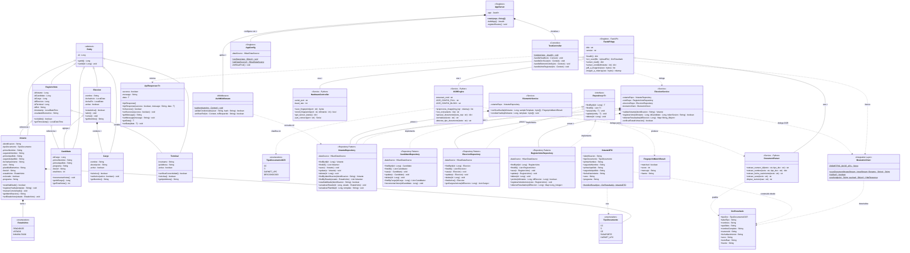

# Diagrama de Clases UML — ABIS-UPC
## Pega el bloque de abajo en: https://mermaid.live  o  https://www.mermaidchart.com

```mermaid
classDiagram
  direction TB

  %% ╔══════════════════════════════════════════════╗
  %% ║         CAPA DE DOMINIO — Entidades          ║
  %% ╚══════════════════════════════════════════════╝

  class Entity {
    <<abstract>>
    -id : Long
    +getId() Long
    +setId(id : Long) void
  }

  class Votante {
    -identificacion : String
    -tipoDocumento : TipoDocumento
    -primerNombre : String
    -segundoNombre : String
    -primerApellido : String
    -segundoApellido : String
    -fechaNacimiento : String
    -sexo : String
    -plantillaBiometrica : String
    -fotoUrl : String
    -estadoVoto : EstadoVoto
    -esJurado : boolean
    -programa : String
    +estaHabilitado() boolean
    +registrarHuella(template : String) void
    +marcarComoVotado() void
    +getIdentificacion() String
    +setEstadoVoto(estado : EstadoVoto) void
  }

  class Candidato {
    -idCargo : Long
    -primerNombre : String
    -primerApellido : String
    -programa : String
    -fotoUrl : String
    -totalVotos : int
    +incrementarVotos() void
    +getIdCargo() Long
    +getTotalVotos() int
  }

  class Cargo {
    -nombre : String
    -descripcion : String
    -activo : boolean
    +isActivo() boolean
    +setActivo(activo : boolean) void
    +getNombre() String
  }

  class Eleccion {
    -nombre : String
    -fechaInicio : LocalDate
    -fechaFin : LocalDate
    -activa : boolean
    +estaActiva() boolean
    +abrir() void
    +cerrar() void
    +getNombre() String
  }

  class RegistroVoto {
    -idVotante : Long
    -idCandidato : Long
    -idCargo : Long
    -idEleccion : Long
    -idTerminal : Long
    -idRol : String
    -timestamp : LocalDateTime
    -resultadoBiometrico : String
    +esValido() boolean
    +getTimestamp() LocalDateTime
  }

  class Terminal {
    -hostname : String
    -ipAddress : String
    -activa : boolean
    +verificarConectividad() boolean
    +isActiva() boolean
    +getIpAddress() String
  }

  %% ╔══════════════════════════════════════════════╗
  %% ║              ENUMERACIONES                   ║
  %% ╚══════════════════════════════════════════════╝

  class TipoDocumento {
    <<enumeration>>
    CC
    TI
    CE
    PASAPORTE
    CARNET_UPC
  }

  class EstadoVoto {
    <<enumeration>>
    PENDIENTE
    VOTADO
    INHABILITADO
  }

  class TipoDocumentoOCR {
    <<enumeration>>
    CC
    TI
    CARNET_UPC
    DESCONOCIDO
  }

  %% ╔══════════════════════════════════════════════╗
  %% ║  CAPA DE REPOSITORIOS — Repository Pattern   ║
  %% ╚══════════════════════════════════════════════╝

  class Repository~T~ {
    <<interface>>
    +findById(id : Long) T
    +findAll() List~T~
    +save(entity : T) void
    +update(entity : T) void
    +delete(id : Long) void
  }

  class VotanteRepository {
    <<Repository Pattern>>
    -dataSource : HikariDataSource
    +findById(id : Long) Votante
    +findAll() List~Votante~
    +save(v : Votante) void
    +update(v : Votante) void
    +delete(id : Long) void
    +findByIdentificacion(identificacion : String) Votante
    +findByEstado(estado : EstadoVoto) List~Votante~
    +estaHabilitado(identificacion : String) boolean
    +actualizarEstado(id : Long, estado : EstadoVoto) void
    +actualizarPlantilla(id : Long, template : String) void
  }

  class CandidatoRepository {
    <<Repository Pattern>>
    -dataSource : HikariDataSource
    +findById(id : Long) Candidato
    +findAll() List~Candidato~
    +save(c : Candidato) void
    +update(c : Candidato) void
    +delete(id : Long) void
    +findByCargo(idCargo : Long) List~Candidato~
    +incrementarVotos(idCandidato : Long) void
  }

  class EleccionRepository {
    <<Repository Pattern>>
    -dataSource : HikariDataSource
    +findById(id : Long) Eleccion
    +findAll() List~Eleccion~
    +save(e : Eleccion) void
    +update(e : Eleccion) void
    +delete(id : Long) void
    +findActiva() Eleccion
    +getCargosActivos(idEleccion : Long) List~Cargo~
  }

  class RegistroVotoRepository {
    <<Repository Pattern>>
    -dataSource : HikariDataSource
    +findById(id : Long) RegistroVoto
    +findAll() List~RegistroVoto~
    +save(r : RegistroVoto) void
    +update(r : RegistroVoto) void
    +delete(id : Long) void
    +yaVoto(idVotante : Long, idEleccion : Long) boolean
    +registrarVotoAtomico(voto : RegistroVoto) void
    +obtenerResultados(idEleccion : Long) Map~Long_Integer~
  }

  %% ╔══════════════════════════════════════════════╗
  %% ║      CAPA DE SERVICIOS — Lógica de negocio   ║
  %% ╚══════════════════════════════════════════════╝

  class EleccionService {
    <<Service>>
    -votanteRepo : VotanteRepository
    -votoRepo : RegistroVotoRepository
    -eleccionRepo : EleccionRepository
    -biometricClient : BiometricClient
    +validarVotante(identificacion : String) Votante
    +registrarVoto(idVotante : Long, idCandidato : Long, tokenSesion : String) boolean
    +obtenerResultados(idEleccion : Long) Map~String_Object~
    -verificarEstadoVotacion() boolean
  }

  class BiometricService {
    <<Service>>
    -votanteRepo : VotanteRepository
    +verificarHuella(idVotante : Long, sampleTemplate : byte[]) FingerprintMatchResult
    +enrollarHuella(idVotante : Long, template : byte[]) void
  }

  %% ╔══════════════════════════════════════════════╗
  %% ║                   DTOs                       ║
  %% ╚══════════════════════════════════════════════╝

  class ApiResponse~T~ {
    -success : boolean
    -message : String
    -data : T
    +ApiResponse()
    +ApiResponse(success : boolean, message : String, data : T)
    +isSuccess() boolean
    +setSuccess(success : boolean) void
    +getMessage() String
    +setMessage(message : String) void
    +getData() T
    +setData(data : T) void
  }

  class VotanteDTO {
    +identificacion : String
    +tipoDocumento : TipoDocumento
    +primerNombre : String
    +segundoNombre : String
    +primerApellido : String
    +segundoApellido : String
    +fechaNacimiento : String
    +sexo : String
    +programa : String
    +fromOcrResult(ocr : OcrResultado) VotanteDTO$
  }

  class FingerprintMatchResult {
    +matched : boolean
    +score : int
    +mensaje : String
    +fuente : String
  }

  class OcrResultado {
    +tipoDoc : TipoDocumentoOCR
    +labelTipo : String
    +nombres : String
    +apellidos : String
    +nombreCompleto : String
    +numeroId : String
    +fechaNacimiento : String
    +sexo : String
    +textoRaw : String
    +fuente : String
  }

  %% ╔══════════════════════════════════════════════╗
  %% ║    CAPA DE INTEGRACIÓN — Facade/HTTP Client  ║
  %% ╚══════════════════════════════════════════════╝

  class BiometricClient {
    <<Integration Layer>>
    -BIOMETRIC_BASE_URL : String$
    +scanDocument(imageStream : InputStream, filename : String) String$
    +isAlive() boolean$
    -post(endpoint : String, payload : Object) HttpResponse$
  }

  %% ╔══════════════════════════════════════════════╗
  %% ║         CAPA DE CONTROLADORES                ║
  %% ╚══════════════════════════════════════════════╝

  class TestController {
    <<Controller>>
    +register(app : Javalin) void$
    -handleHealth(ctx : Context) void
    -handleOcrScan(ctx : Context) void
    -handleBiometricVerify(ctx : Context) void
    -handleVotoRegistrar(ctx : Context) void
  }

  class AuthMiddleware {
    <<Middleware>>
    +authenticate(ctx : Context) void$
    -validarCredenciales(user : String, hash : String) boolean
    -verificarRol(ctx : Context, rolRequerido : String) boolean
  }

  %% ╔══════════════════════════════════════════════╗
  %% ║       SERVIDOR Y CONFIGURACIÓN               ║
  %% ╚══════════════════════════════════════════════╝

  class AppServer {
    <<Singleton>>
    -app : Javalin
    +main(args : String[])$
    -buildApp() Javalin
    -registerRoutes() void
  }

  class AppConfig {
    <<Singleton>>
    -dataSource : HikariDataSource
    +configure(app : Object) void$
    +getDataSource() HikariDataSource$
    -initHikariPool() void
  }

  %% ╔══════════════════════════════════════════════╗
  %% ║   MICROSERVICIO PYTHON — FastAPI (puerto 8000)║
  %% ╚══════════════════════════════════════════════╝

  class FastAPIApp {
    <<Singleton - FastAPI>>
    -title : str
    -version : str
    +health() dict
    +ocr_scan(file : UploadFile) OcrResultado
    +sensor_read() dict
    +sensor_enroll(idVotante : int) dict
    -pdf_a_imagenes(raw : bytes) list
    -imagen_a_ndarray(raw : bytes) ndarray
  }

  class OCREngine {
    <<Service - Python>>
    -tesseract_cmd : str
    -OCR_CONFIG_FULL : str
    -OCR_CONFIG_BLOCK : str
    +preprocess_image(img_bgr : ndarray) list
    +run_ocr(variants : list) str
    +parsear_documento(texto_raw : str) dict
    -normalizar(texto : str) str
    -detectar_tipo_documento(texto : str) str
  }

  class DocumentParser {
    <<Service - Python>>
    +extraer_numero_id(texto : str, tipo_doc : str) str
    +extraer_nombre(texto : str, tipo_doc : str) dict
    +extraer_fecha_nacimiento(texto : str) str
    +extraer_sexo(texto : str) str
    -limpiar_numero(raw : str) str
  }

  class HardwareController {
    <<Service - Python>>
    -serial_port : str
    -baud_rate : int
    +scan_fingerprint(port : str) bytes
    +enroll_fingerprint(port : str, idVotante : int) bool
    +get_sensor_status() dict
    -uart_connect(port : str) Serial
  }

  %% ╔══════════════════════════════════════════════╗
  %% ║    RELACIONES — Herencia  <|--               ║
  %% ╚══════════════════════════════════════════════╝

  Entity <|-- Votante
  Entity <|-- Candidato
  Entity <|-- Cargo
  Entity <|-- Eleccion
  Entity <|-- RegistroVoto
  Entity <|-- Terminal

  Repository~T~ <|.. VotanteRepository : implements
  Repository~T~ <|.. CandidatoRepository : implements
  Repository~T~ <|.. EleccionRepository : implements
  Repository~T~ <|.. RegistroVotoRepository : implements

  %% ╔══════════════════════════════════════════════╗
  %% ║   RELACIONES — Composición  *--              ║
  %% ╚══════════════════════════════════════════════╝

  Votante *-- TipoDocumento : tiene >
  Votante *-- EstadoVoto : tiene >
  Eleccion *-- Cargo : contiene >
  EleccionService *-- VotanteRepository : posee >
  EleccionService *-- RegistroVotoRepository : posee >
  EleccionService *-- EleccionRepository : posee >
  BiometricService *-- VotanteRepository : posee >
  AppServer *-- TestController : inicializa >
  AppServer *-- AuthMiddleware : aplica >
  AppServer *-- AppConfig : configura con >

  %% ╔══════════════════════════════════════════════╗
  %% ║   RELACIONES — Agregación  o--               ║
  %% ╚══════════════════════════════════════════════╝

  Eleccion o-- Candidato : agrupa >
  RegistroVoto o-- Votante : referencia >
  RegistroVoto o-- Candidato : referencia >
  RegistroVoto o-- Terminal : emitido desde >
  FastAPIApp o-- OCREngine : usa >
  FastAPIApp o-- DocumentParser : usa >
  FastAPIApp o-- HardwareController : usa >

  %% ╔══════════════════════════════════════════════╗
  %% ║   RELACIONES — Dependencia  ..>              ║
  %% ╚══════════════════════════════════════════════╝

  TestController ..> BiometricClient : invoca
  TestController ..> ApiResponse~T~ : retorna
  TestController ..> EleccionService : delega
  AuthMiddleware ..> VotanteRepository : consulta rol
  EleccionService ..> BiometricClient : delega OCR
  BiometricService ..> FingerprintMatchResult : produce
  BiometricClient ..> OcrResultado : deserializa
  VotanteDTO ..> OcrResultado : construido desde
  VotanteDTO ..> TipoDocumento : usa
  OCREngine ..> TipoDocumentoOCR : clasifica en
  OCREngine ..> DocumentParser : delega parseo
  DocumentParser ..> OcrResultado : puebla
```
