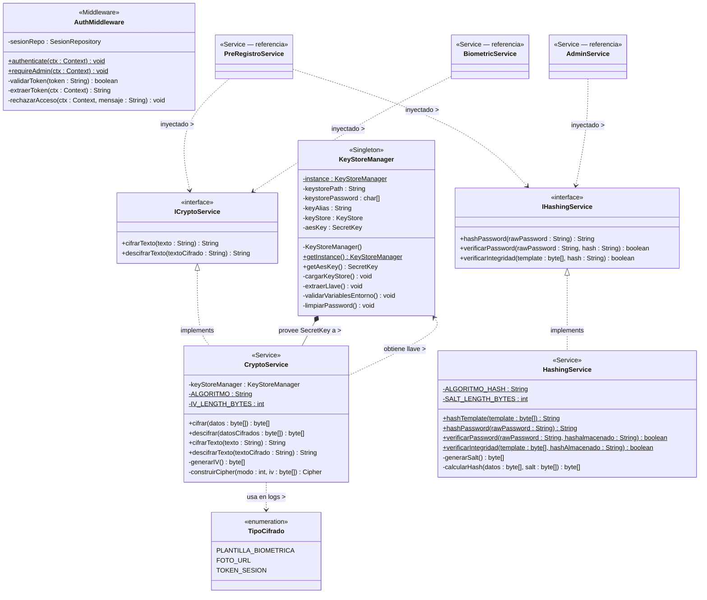

# UML — ABIS-UPC | Capa de Seguridad JCA + Ley 1581/2012
## Documento exclusivo para: feature/security — Ing. Daniel Flórez
## Pega el bloque mermaid en: https://mermaid.live  o  https://www.mermaidchart.com
##
## ══════════════════════════════════════════════════════════════════
## CONTEXTO PARA DANIEL FLÓREZ
## ══════════════════════════════════════════════════════════════════
##
## Este diagrama cubre EXCLUSIVAMENTE tu rama: feature/security
## Paquete Java: com.abisupc.security
##
## Tu trabajo no depende de que feature/dao-oracle esté listo porque
## CryptoService, HashingService y KeyStoreManager trabajan en memoria.
## Puedes arrancar desde el día uno.
##
## ══════════════════════════════════════════════════════════════════
## MARCO LEGAL — LEY 1581 DE 2012 (HABEAS DATA)
## ══════════════════════════════════════════════════════════════════
##
## Art. 9 — Autorización del titular:
##   El votante debe dar consentimiento EXPLÍCITO antes del pre-registro.
##   Se registra en VOTANTES.fechaConsentimiento (Timestamp).
##   PreRegistroService.registrarConsentimiento() lo persiste.
##
## Art. 12 — Derecho de supresión:
##   VotanteRepository.anonimizarDatosBiometricos() borra
##   plantillaBiometrica y fotoUrl pero conserva el registro electoral.
##   Esta operación NO elimina la fila — solo limpia los datos biométricos.
##
## Art. 17 — Deber de seguridad:
##   Justificación legal directa para CryptoService y KeyStoreManager.
##   Cualquier auditoría puede citar este artículo para explicar AES-256.
##
## ══════════════════════════════════════════════════════════════════
## VARIABLES DE ENTORNO REQUERIDAS — configurar ANTES de arrancar
## ══════════════════════════════════════════════════════════════════
##
## ABIS_KEYSTORE_PATH      → ruta al archivo .jks en el sistema
## ABIS_KEYSTORE_PASSWORD  → contraseña maestra del KeyStore
## ABIS_AES_KEY_ALIAS      → alias de la llave AES-256 dentro del .jks
##
## Para generar el archivo .jks (ejecutar UNA sola vez por máquina):
##   keytool -genseckey -alias abis-aes-key -keyalg AES -keysize 256
##            -storetype JCEKS -keystore abis-upc.jks
##
## El archivo .jks está en .gitignore — NUNCA va al repositorio.
## Cada desarrollador genera el suyo propio para desarrollo local.
## El de producción lo genera y custodia únicamente el administrador.
##
## ══════════════════════════════════════════════════════════════════
## QUÉ DATOS SE CIFRAN CON AES-256
## ══════════════════════════════════════════════════════════════════
##
## plantillaBiometrica: el template del AS608 antes de guardarse en Oracle.
##   PreRegistroService llama a CryptoService.cifrarTexto() antes del save().
##   BiometricService llama a CryptoService.descifrarTexto() antes de enviar
##   el template a Python para comparación.
##
## fotoUrl: la URL de la foto del votante también se cifra en reposo.
##   Se descifra solo cuando VotantePerfilDTO necesita mostrarla en kiosco.
##
## ══════════════════════════════════════════════════════════════════
## QUÉ SE HASHEA CON SHA-256
## ══════════════════════════════════════════════════════════════════
##
## hashIntegridadBiometrica: SHA-256 del template original (antes de cifrar).
##   Se guarda en VOTANTES.hashIntegridadBiometrica.
##   Al leer el template de vuelta, se recalcula el hash y se compara.
##   Si no coincide → el template fue alterado en la BD → alerta de seguridad.
##
## passwordHash en Administrador: BCrypt no está en JCA estándar.
##   Usar SHA-256 con salt o añadir la dependencia jBCrypt al pom.xml.
##   Recomendación: SHA-256 + salt aleatorio almacenado junto al hash.
##
## ══════════════════════════════════════════════════════════════════
## RELACIÓN CON OTRAS RAMAS
## ══════════════════════════════════════════════════════════════════
##
## feature/dao-oracle (Mateo + Jorge):
##   VotanteRepository.anonimizarDatosBiometricos() → ellos implementan el método
##   VOTANTES.fechaConsentimiento → ellos añaden la columna al DDL
##   VOTANTES.hashIntegridadBiometrica → ellos añaden la columna al DDL
##
## feature/services (Daniel Turizo):
##   PreRegistroService usa CryptoService y HashingService
##   BiometricService usa CryptoService
##   AdminService usa HashingService para verificar passwords
##
## Tu entregable: las 3 clases de este diagrama compilando y con tests unitarios.
## Daniel Turizo las inyecta en los servicios cuando merge feature/dao-oracle.

